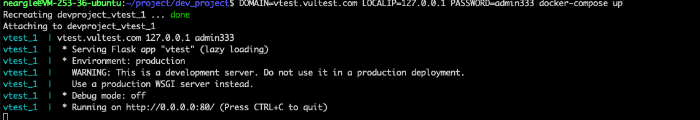
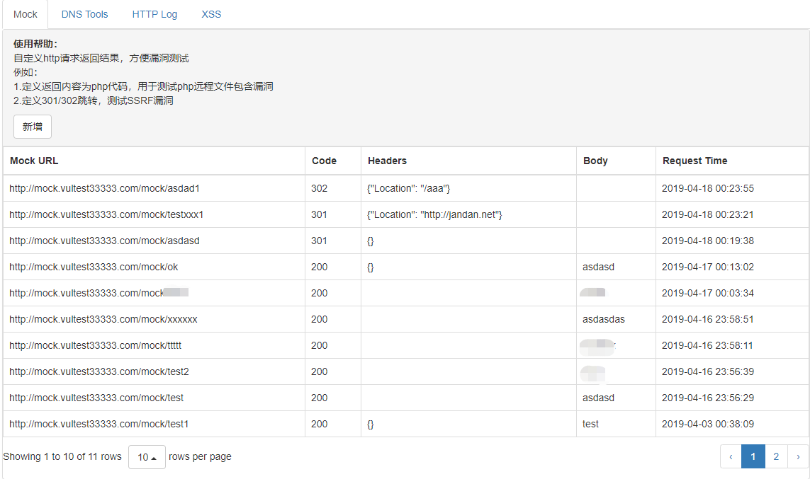
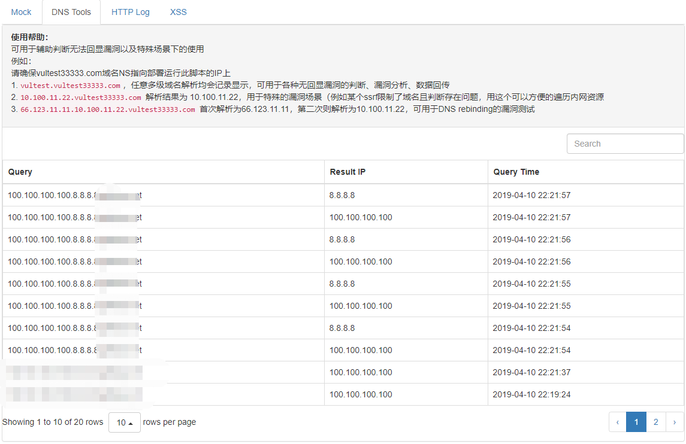
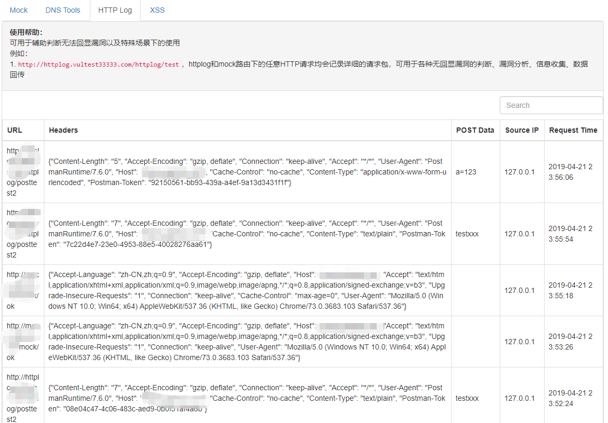
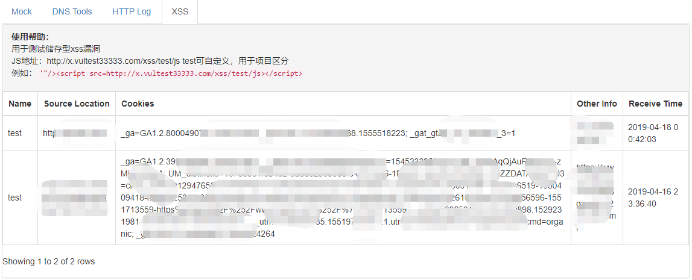

## VTest - 漏洞测试辅助系统

用于辅助安全工程师漏洞挖掘、测试、复现，集合了mock、httplog、dns tools、xss，可用于测试各类无回显、无法直观判断或特定场景下的漏洞，例如：存储型xss、ssrf、远程代码执行/注入、远程命令执行/注入、文件包含等。

### 项目特点

- 使用方便，集成常用的辅助功能
- 零部署难度，python环境中直接运行即可

### 功能介绍

####  Mock

自定义http请求返回包，例如以下场景： 

- 定义返回内容为php代码，用于测试php远程文件包含漏洞 

- 定义301/302跳转，测试SSRF漏洞

#### DNS Tools

用于辅助判断无法回显的漏洞以及特殊场景下的使用，有如下三种使用方式

- `vultest.yourdomain.net`，任意多级的子域名解析均会记录显示，可用于各种无回显漏洞的判断、漏洞分析、数据回传 
- `10.100.11.22.yourdomain.net` 解析结果为 10.100.11.22，用于特殊的漏洞场景的利用（例如某个ssrf限制了域名且判断存在问题，用这个可以方便的遍历内网资源 ）或限制测试
- `66.123.11.11.10.100.11.22.yourdomain.com` 首次解析为66.123.11.11，第二次则解析为10.100.11.22，可用于DNS rebinding的漏洞测试

#### HTTP Log

记录任意HTTP请求详细包，可用于各种无回显漏洞的判断、漏洞分析、信息收集、数据回传

#### XSS

用于测试储存型xss漏洞


#### API
新增api功能, 查询记录是否存在, 用于漏洞检测:

- http://login.example.com/api/http?token=token&limit=1&offset=0&q=xxx
- http://login.example.com/api/dns?token=token&limit=1&offset=0&q=xxx

返回结果:

```
{"rows":[{"domain":"1.1.1.2.i.example.com","insert_time":"2019-05-12 08:58:01","ip":"1.1.1.2"}],"status":"1"}
```

### 系统部署

Python2.7 环境

```shell
# 安装依赖库
pip install flask flask-httpauth
# 参数说明：
# -d 你的域名，需要指向ns记录到此服务器上，具体流程请看domain.md
# -h 对外服务的IP，可不填，默认会自动获取外网IP
# -p 系统登录密码，默认密码为admin，用户名固定为admin
python vtest.py -d vultest.com -p admin333
```


## IN DOCKER && DOCKER-COMPOSE

run:

```shell
DOMAIN=vtest.vultest.com LOCALIP=127.0.0.1 PASSWORD=admin333 docker-compose up -d
```

log:




### 界面图

- Mock



- DNS Tools



- HTTP Log



- XSS



### 其他说明
本系统仅以记录日志和提供返回包自定义功能，辅助于开发和安全工程师进行相关判断，不存在也不会发起任何攻击请求。
